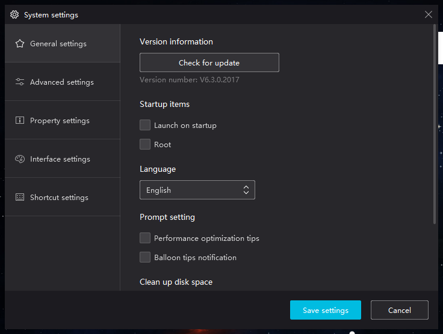
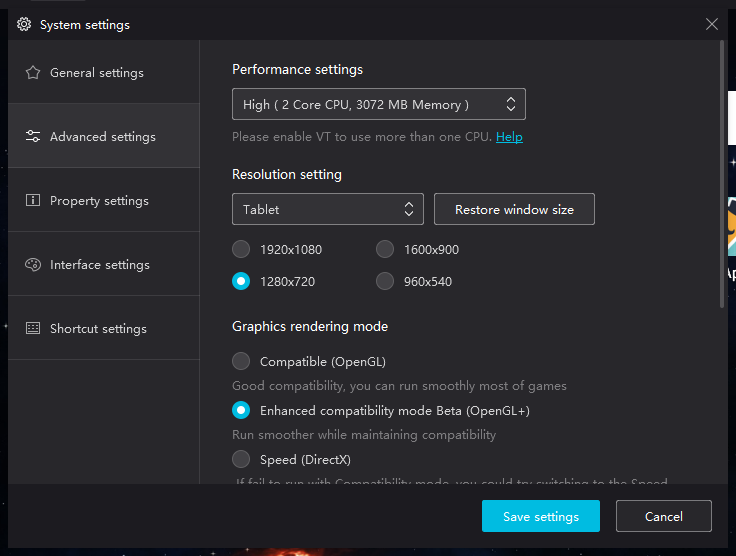
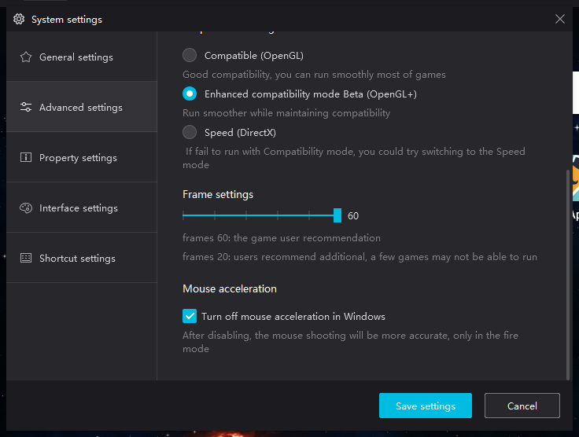
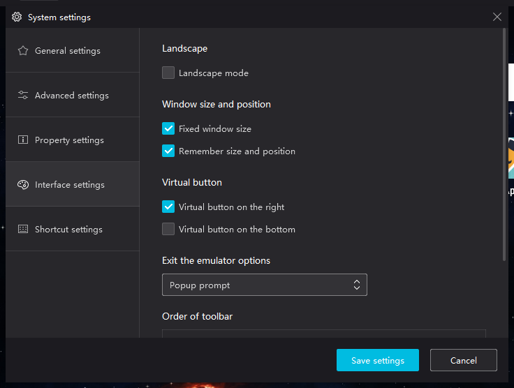
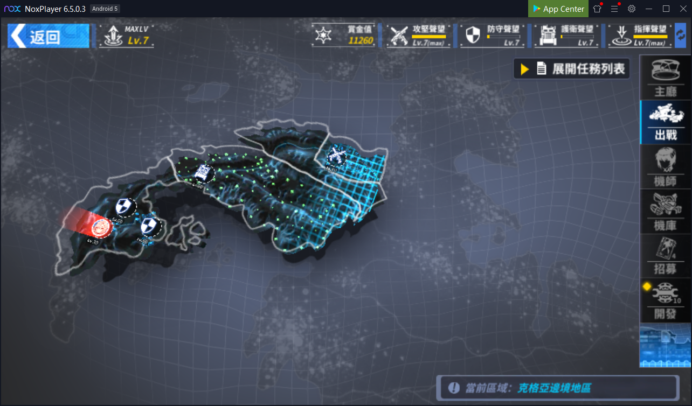
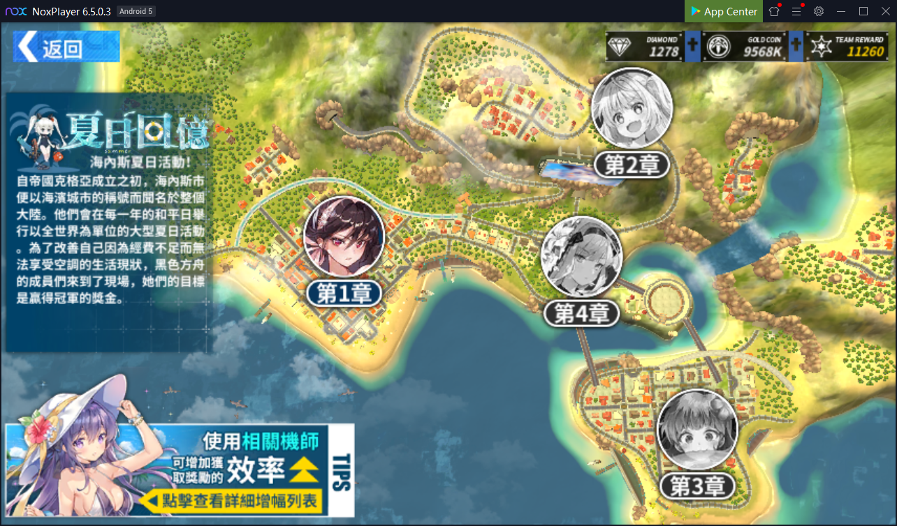

# FinalGearBot

Python bot for lazy people to play [FinalGear](https://www.komoejoy.com/FinalGear//) (TW server)

## Requirement

- Use Windows 10
- Support Python 3.X.X
- Support PyAutoGUI

## Installation

* Download free Android emulator from [NoxPlayer](https://www.bignox.com/)

* Install in to your Windows

* Enable [virtualization](https://support.bluestacks.com/hc/en-us/articles/115003174386-How-can-I-enable-virtualization-VT-on-my-PC-)

* Follow the settings:

  
      
  
      
  
      
  

---

## Mode

Start bot by typing following commands in this current directory

### Normal

1. Go to event screen:



2. Enter command:

  ```shell
  $ py .\normal_mode.py
  ```

---

### Summer Memory

1. Go to event screen:



2. Enter command:

| Parameter           | Value            | Detail                 |
| ------------------- | ---------------- | ---------------------- |
| Chapter Number      | `1`-`4`          | Chapter number         |
| Team                | `1`-`4`          | Team number            |
| Boss Stage Run Time | Unsigned Integer | Number of running time |
| Boss Quest Run Time | Unsigned Integer | Number of running time |

  Run summer memory, chapter 2 stage using team `4` to run boss stage `3` times and quest stage `17` times

  ```shell
  $ py .\summer_memory_mode.py 2 4 3 17
  ```
